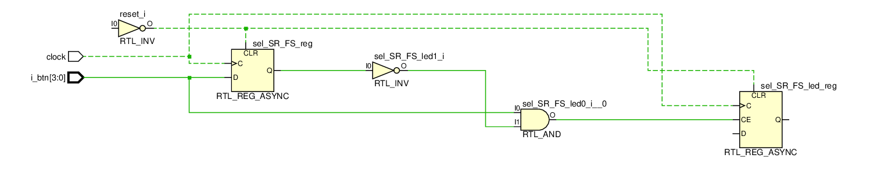

My notes: reasonings and explanations
=====================================

In this file I will dump stuff I found out or learned.
The information here will probably be fully wrong or at least, partially wrong.
I am by no mean accountable if what you see here causes any damage (such as but not
limited to destroying a board, causing an aneurysm) whatsoever.

### Checking the program logic

After implementing a code of a module or series of modules and top-modules, you can check
the "inferred logic" or behaviour of the program.

Using the `Run Simulation` > `Simulate Behaviour` option it makes a sort of simulation
of the code you wrote.

First you can check the generated [circuit or schematic](visuals/behaviour_schematic.pdf):

We can se how the code translated to electronic hw.
For example, check the speed selector (two bit input MUX for R0-R3), the implementation
here is to use 3 MUX's concatenated one with another.
I don't really know __why__ this is done so and not just the one MUX, it might be b/c of
FPGA internals (such as the basic logic unit being optimized with 2bin inputs).
The fact remains that this is the way it works, and we can check/modify de code accordingly.

Here we can also check out the inferred logic of the mode selector register.
On the code, I made a fabulous ASCII art that I will copy here.
This tried to exemplify what I hoped my code would infer.

	             _________________     __
	            |      ______     |___|  )______ sel_SR_FS_led
	sel_SR_FS___|______|D  Q|_______o_|__)
	                   |    |           AND
	             clk___|____|

To check whether this is done correctly by the tool, we can look for the `sel_SR_FS_led`
register, and the associated logic:

Here the, `i_btn[0]` is associated to the 'register' `sel_SR_FS`.
It's amazing, but it actually inferred what we hoped it would!!!
Magic at it's purest form, no doubt.

### Checking the working logic - Testbench and simulation.

TODO.

### Checking the "real" electronic output

The previous output is just the basic logic behaviour expected form the code.
But it really is not the way it will be implemented on the actual FPGA.
To do this, we need to create a __constraint__ file.
This file is nothing more than a (real port)-(local registers) association.
It is unique to the board you are using (Artix 07-35 in this case).

After running the behaviour simulation, and writing up a constraint file, we can run
and implementation of the code.
This is done unsurprisingly with the "Run Implementation" option.

Here I link this "real" or "real-er" [electronic schematic](visuals/infered_schematic.pdf) for the code.

This is a whole mess. It actually might be useful to check the more real implementation
of things like adders or multipliers, etc.

On the next example, where we use filters, this **might** be more useful, but I doubt it.
